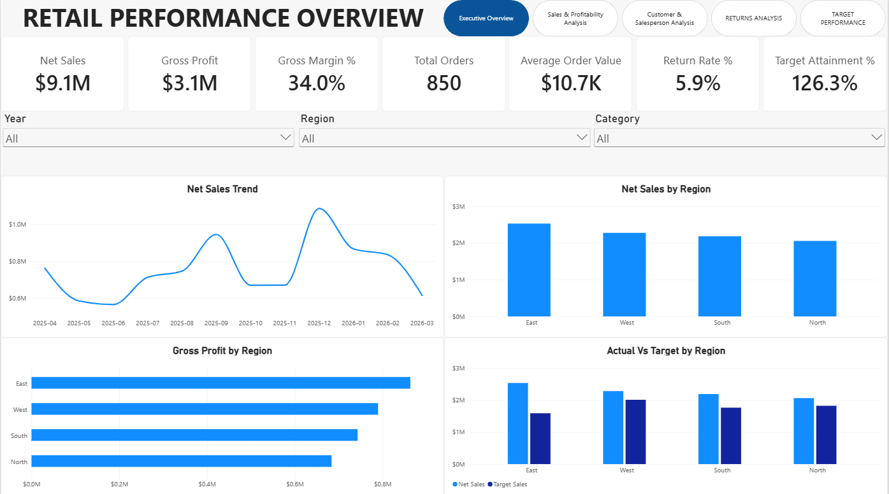
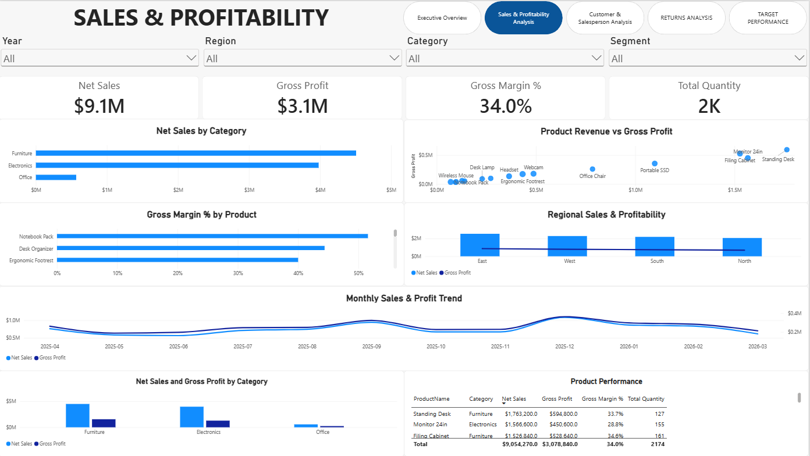
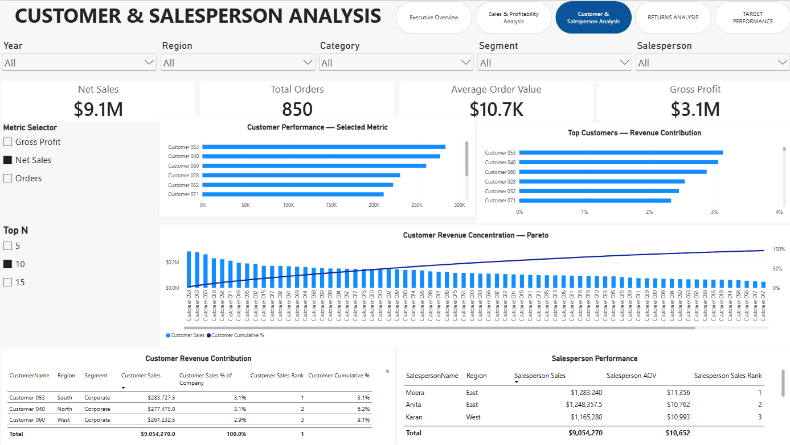
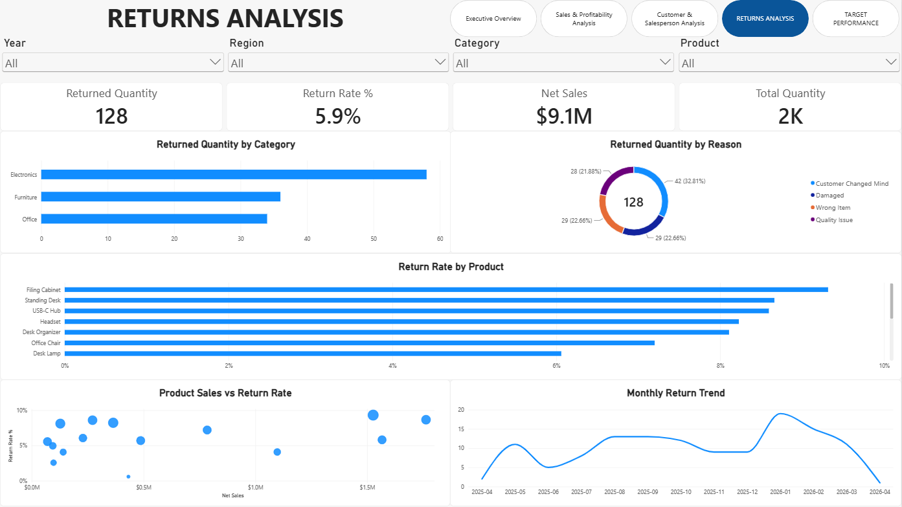
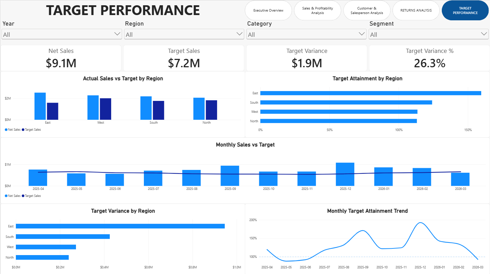

# Retail Performance Analysis — Power BI

> An end-to-end Power BI business intelligence project focused on retail sales, profitability, customer concentration, returns, salesperson performance, and target attainment.

**Project Status:** Completed

---

## 📊 Project Overview

This project analyzes retail business performance using Power BI.

The objective was to transform raw retail transaction data into an interactive business intelligence solution that helps management understand:

- Overall sales performance
- Gross profit and profitability
- Regional performance
- Product and category contribution
- Customer revenue concentration
- Salesperson performance
- Product return behaviour
- Actual sales versus targets
- Business risks and opportunities

The project goes beyond dashboard creation by using the analysis to answer business questions and develop evidence-based recommendations.

---

## 🎯 Business Objectives

The analysis focuses on the following business questions:

1. Which region is performing strongest, and why?
2. Which product and category generate the strongest revenue and gross profit?
3. Which region has the weakest target attainment?
4. Is there evidence of customer concentration risk?
5. Which product or category has the most concerning return behaviour?
6. Which salesperson performs best across multiple performance dimensions?
7. Where does high sales volume not necessarily mean strong overall performance?
8. What recommendations can management take from the analysis?

---

## 🛠️ Tools & Technologies

- Power BI Desktop
- Power Query
- DAX
- Microsoft Excel
- Data Modelling
- Star Schema
- Interactive Data Visualization
- Drill-through
- Report Page Tooltips
- Dynamic Metric Selection
- Top-N Analysis
- Pareto Analysis

---

## 📌 Key Results

| KPI                 |     Result |
| ------------------- | ---------: |
| Net Sales           | **$9.05M** |
| Gross Profit        | **$3.08M** |
| Gross Margin        |  **34.0%** |
| Total Orders        |    **850** |
| Average Order Value | **$10.7K** |
| Returned Quantity   |    **128** |
| Return Rate         |   **5.9%** |
| Target Sales        | **$7.17M** |
| Target Attainment   | **126.3%** |
| Target Variance     | **$1.88M** |

---

## ⭐ Project Highlights

- End-to-end Power BI data analytics workflow
- Star-schema data model
- DAX-based business KPIs
- Dynamic metric selection
- Top-N customer analysis
- Customer Pareto analysis
- Regional target attainment
- Product return analysis
- Customer drill-through
- Product report-page tooltip
- Evidence-based business recommendations

---

## 🖥️ Dashboard Preview

### Executive Overview

The Executive Overview provides management with a high-level view of sales, profitability, regional performance, target performance, and trends.



---

## 📊 Report Pages

### 1. Executive Overview

Provides a management-level summary of:

- Net Sales
- Gross Profit
- Gross Margin
- Total Orders
- Average Order Value
- Return Rate
- Target Attainment
- Monthly sales trend
- Sales by region
- Gross profit by region
- Actual sales versus target


---

### 2. Sales & Profitability Analysis

Focuses on product, category, regional and monthly profitability.

Key analysis includes:

- Net Sales by Category
- Product Revenue versus Gross Profit
- Gross Margin by Product
- Regional Sales & Profitability
- Monthly Sales & Profit Trend
- Net Sales and Gross Profit by Category
- Product Performance



---

### 3. Customer & Salesperson Analysis

Analyzes customer contribution and salesperson performance.

Key features include:

- Dynamic metric selection
- Top-N customer analysis
- Customer revenue contribution
- Customer ranking
- Customer cumulative contribution
- Pareto analysis
- Salesperson sales
- Salesperson AOV
- Salesperson ranking



---

### 4. Returns Analysis

Examines product returns and return behaviour.

Key analysis includes:

- Returned Quantity
- Return Rate
- Returned Quantity by Category
- Returned Quantity by Reason
- Return Rate by Product
- Product Sales versus Return Rate
- Monthly Return Trend



---

### 5. Target Performance

Compares actual sales performance against regional and monthly targets.

Key analysis includes:

- Actual Sales versus Target
- Target Attainment by Region
- Monthly Sales versus Target
- Target Variance by Region
- Monthly Target Attainment Trend



---

## 🔎 Key Business Insights

### Strongest Region

East is the strongest overall region.

It leads the business in net sales, gross profit and target attainment.

East generates approximately **$2.53M in sales** and achieves approximately **159.7% target attainment**.

---

### Category Performance

Furniture is the largest category in both revenue and gross profit contribution.

However, Office has the highest gross margin.

This demonstrates that the largest revenue contributor is not necessarily the most efficient category in percentage-margin terms.

---

### Product Performance

Standing Desk is the strongest individual product based on both revenue and gross profit.

It generates approximately:

- **$1.76M Net Sales**
- **$594.8K Gross Profit**
- **33.7% Gross Margin**

---

### Target Performance

North has the lowest target attainment among the four regions at approximately **113%**.

However, North is still exceeding its target.

Therefore, this should be interpreted as relative underperformance rather than an actual target failure.

---

### Customer Concentration

Customer revenue is relatively diversified.

The largest individual customer contributes approximately **3.1%** of total company sales, while the top three customers contribute approximately **9.1%**.

This indicates that the business is not heavily dependent on a single customer or a very small number of customers.

---

### Return Behaviour

Filing Cabinet has the highest product-level return rate at approximately **9.3%** while also generating substantial sales.

This makes it an important product for further investigation.

At category level, Furniture has the highest return rate among the major categories.

---

### Salesperson Performance

Meera is the strongest overall salesperson based on the available performance dimensions.

She leads in sales and gross profit while also maintaining a strong average order value.

Arjun, however, has a slightly higher gross margin, demonstrating that the salesperson with the highest sales is not automatically the most efficient on every metric.

---

### Revenue Does Not Equal Overall Performance

Monitor 24in is an important example.

It generates approximately **$1.57M in sales**, making it one of the largest revenue contributors.

However, its gross margin is only approximately **28.8%**, which is below the overall business margin of approximately 34%.

This indicates that revenue ranking alone is not sufficient to evaluate product performance.

---

## 💡 Recommendations

### 1. Investigate Filing Cabinet Returns

**Evidence:** Filing Cabinet has a product return rate of approximately 9.3%.

**Problem:** A commercially important product is experiencing relatively high returns.

**Recommendation:** Analyze detailed return reasons and operational causes to determine whether the issue is related to product quality, damage, fulfilment errors, customer preference, or another factor.

---

### 2. Review Monitor 24in Profitability

**Evidence:** Monitor 24in generates approximately $1.57M in sales but has a gross margin of approximately 28.8%.

**Problem:** A high-revenue product is generating below-average margin.

**Recommendation:** Review product cost, discounting and pricing structure to identify opportunities to improve profitability without unnecessarily reducing demand.

---

### 3. Investigate East's Performance Drivers

**Evidence:** East leads in sales, gross profit and target attainment.

**Problem:** There is a significant performance gap between East and the other regions.

**Recommendation:** Analyze East's customer mix, product mix, salesperson performance and average order value to identify practices that could potentially be replicated in other regions.

---

## 🧩 Data Model

The Power BI model follows a star-schema approach.

### Fact Tables

- FactSales
- FactReturns
- FactTargets

### Dimension Tables

- DimDate
- DimCustomer
- DimProduct
- DimSalesperson
- DimRegion

The model connects business dimensions to the appropriate fact tables so that sales, returns and targets can be analyzed consistently across time, region, customer, product and salesperson.

More details are available in:

[`Documentation/Data_Model.md`](Documentation/Data_Model.md)

---

## 📐 DAX & Business Calculations

The project contains measures for:

- Net Sales
- Gross Profit
- Gross Margin %
- Total Orders
- Total Quantity
- Average Order Value
- Returned Quantity
- Return Rate %
- Target Sales
- Target Variance
- Target Variance %
- Target Attainment %
- Customer Sales
- Customer Sales % of Company
- Customer Sales Rank
- Customer Cumulative %
- Salesperson Sales
- Salesperson AOV
- Salesperson Sales Rank
- Dynamic Metric Selection
- Top-N Analysis

More details are available in:

[`Documentation/DAX_Measures.md`](Documentation/DAX_Measures.md)

---

## 🧹 Data Preparation

The source data contained two intentionally included data-quality issues:

- One duplicated sales row
- One missing `DiscountPct` value

The duplicate sales record was identified and removed from the analytical dataset.

The missing discount value was treated as zero for the cleaned calculation because the analysis interpreted the blank discount as no discount. This assumption should be documented rather than silently applied.

Order-level metrics were also defined carefully because the sales table contains product-line records rather than one row per order.

---

## 🔄 Interactivity

The report includes:

- Page navigation
- Slicers
- Dynamic metric selection
- Top-N analysis
- Customer drill-through
- Product report-page tooltip
- Cross-filtering between visuals

The Customer Details page is used as a drill-through page, while the Product Tooltip page is used as a report-page tooltip.

---

## 🎓 Final Professional Judgement

The analysis shows that the business is performing strongly overall, exceeding its sales target by approximately 26%.

However, revenue alone does not provide a complete picture of business performance.

East is the strongest region, while Furniture and Standing Desk are major revenue and gross-profit contributors.

At the same time, Monitor 24in has strong revenue but weaker margin, and Filing Cabinet combines strong sales with a high return rate.

Further investigation would be required to determine the causes behind these patterns.

Additional data such as detailed product costs, return-level information, customer history and salesperson activity would improve the analysis.

I would avoid unsupported conclusions such as assuming that Filing Cabinet has a quality problem, that Monitor 24in is overpriced, or that East's performance is solely caused by its sales team.

---

## 📁 Repository Structure

```text
retail-performance-analysis-powerbi/
│
├── README.md
│
├── PowerBI/
│   └── Retail_Performance_Analysis.pbix
│
├── Data/
│   └── README.md
│
├── Screenshots/
│   ├── 01_Executive_Overview.png
│   ├── 02_Sales_Profitability.png
│   ├── 03_Customer_Salesperson.png
│   ├── 04_Returns_Analysis.png
│   ├── 05_Target_Performance.png
│   ├── 06_Customer_Details.png
│   └── 07_Product_Tooltip.png
│
└── Documentation/
    ├── Business_Analysis.md
    ├── Data_Model.md
    └── DAX_Measures.md
```
